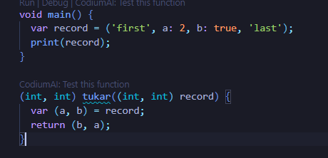

# Pemrograman Mobile - Pertemuan 4

NIM : 2141720114

NAMA : Agung Malik Al Qindy

ABSEN : 03

KELAS : 3D

## Praktikum 

### Langkah 1


### Langkah 2

- Kode program berjalan lancar 

### Langkah 3

- assert akan menghasilkan error, untuk solusi nya adalah mengubah nilai assert list.length nya menjadi 5

- kode program setelah di fix


## Praktikum 2

### Langkah 1


### Langkah 2

- seperti pada list, tipe data set akan menampilkan hasil urut sesuai index

### Langkah 3

- kode berjalan tanpa error, yang menampilkan kurung kurawa kosong 

- Setelah ditambahkan elemen nama dan NIM dengan dua fungsi yang berbeda


## Praktikum 3

### Langkah 1


### Langkah 2


- tipe data maps akan menampilkan key dan value yang dapat berupa string, int, atau objek lain

### Langkah 3


- Jika ingin mengganti value dari sebuah key, maka dengan cara memanggil ulang sebuah key seperti contoh gifts['fifth'] yang merujuk pada key 'fifth' yang sudah ada sebelumnya dan diikuti dengan = (value baru yang ingin diganti pada key sebelumnya)  


##### Menambahkan Eleman nama dan NIM pada tiap variabel


## Praktikum 4

### Langkah 1


### Langkah 2

- error tersebut disebabkan karena variabel list1 masih belum di deklarasi

- Setelah di fix:


- tanda ... pada kode tersebut digunakan untuk menggabungkan nilai list dengan nilai dari variabel list lainnya

### Langkah 3


- pada error diatas, sama seperti sebelumnya, variabel masih belum di deklarasi

- setelah di fix:


##### Error 2


- tanda ? pada spread operator dapat digunakan pada map, tetapi pada  kasus tersebut menggunakan list yang hanya menggunakan ... saja

- setelah di fix:


- Hasil:


##### Menambahkan variabel list berisi NIM menggunakan Spread Operators

```dart
  var list4 = [2141720041];
  var list5 = [0, ...list4];

  print(list5);
```

- Hasil


### Langkah 4


- variabel promoActive masih belum di deklarasi dan di inisialisasi


#### Jika promoActive true


#### Jika promoActive false


- pada code diatas promoActive ketika bernilai true maka nilai yang berada didalam kondisi if akan dijalankan, sedangkan jika promoActive bernilai false nilai yang berada di dalam if yaitu 'Outlet' tidak akan dijalankan karena kondisi bernilai false sehingga yang akan ditampilkan ketika program dijalankan hanyalah nilai yang tidak masuk di dalam kondisi if

### Langkah 5

- error karena variabel login belum di deklarasi dan di inisialisasi

- Setelah di fix:


#### Jika variabel login memiliki kondisi lain:


### Langkah 6

- Collection for dapat digunakan untuk membuat data pada list yang memiliki pola berulang sehingga dapat menyingkat program

## Praktikum 5

### Langkah 1


### Langkah 2

- record dapat menampilkan isi berupa kombinasi antara list dengan maps

### Langkah 3



- fungsi tukar pada program diatas menggunakan record yang digunakan untuk menukar posisi nilai record2

### Langkah 4

- error karena variabel masih belum memiliki value 


### Langkah 5


- jika ingin mengakses value dalam records, jika data berupa data biasa tanpa key, maka cukup mengakses menggunakan index nya, tetapi jika ingin mengakses value maps, maka untuk menampilkan valuenya menggunakan key milik value yang ingin di tampilkan

#### Mengganti isi record dengan nama dan NIM


## Tugas Praktikum

2. Functions adalah adalah sekumpulan kode dalam 1 fungsi yang dapat digunakan berkali kali untuk melakukan tugas tertentu. functions berisi kumpulan kode logika yang dapat dipanggil untuk keperluan tertentu

3. Jenis-jenis parameter
    - Required Parameters:

        Parameter ini harus diberikan saat memanggil fungsi, dan jumlahnya harus sesuai dengan yang dideklarasikan dalam fungsi.

        ```dart
        void greet(String name) {
        print('Hello, $name!');
        }

        ```

    - Optional Parameter:

        Optional parameters tidak wajib diberikan saat memanggil fungsi.


        Terdapat dua jenis parameter opsional:
        
        - Named Parameters:

            Didefinisikan dengan menggunakan {} dalam deklarasi fungsi.

            ```dart
            void printOrder({String item, int quantity}) {
            print('Order: $item, Quantity: $quantity');
            }

            ```
        - Positional Parameters:

            Didefinisikan dengan menggunakan [] dalam deklarasi fungsi.

            ```dart
            void showInfo(String name, [int age = 30]) {
            print('Name: $name, Age: $age');
            }

            ```

4. Dart mendukung konsep "functions as first-class objects," yang artinya fungsi dapat digunakan seperti tipe data lainnya, seperti variabel atau argumen untuk fungsi lain. Contoh:
    ```dart
    void sayHello(String name) {
    print('Hello, $name!');
    }

    void main() {
    var greeting = sayHello;

    // Memanggil fungsi melalui variabel
    greeting('Alice');
    }

    ```

5. Anonymous functions adalah fungsi yang tidak memiliki nama dan dapat didefinisikan dan digunakan di tempat yang sama. Dart memiliki dua jenis anonymous functions: lambda expressions dan anonymous function expressions. Contoh:
    
    ```dart
    // Lambda expression
    var add = (int a, int b) => a + b;

    // Anonymous function expression
    var multiply = (int x, int y) {
    return x * y;
    };

    ```

6. Perbedaan:
    - Lexical Scope: Lexical scope adalah aturan dalam bahasa pemrograman di mana cakupan atau ruang lingkup variabel ditentukan oleh tempat variabel tersebut dideklarasikan dalam kode sumber, bukan tempat variabel tersebut dipanggil atau digunakan.

        ```dart
        void main() {
        var x = 10;

        void printX() {
            print(x); // Variabel x diambil dari lexical scope
        }

        printX();
        }

        ```

    - Lexical Closures: Lexical closure adalah kemampuan sebuah fungsi untuk mengakses variabel-variabel dari lexical scope di mana fungsi tersebut didefinisikan, bahkan jika fungsi tersebut dipanggil di luar lexical scope tersebut.

        ```dart
        Function makeCounter() {
        var count = 0;
        return () {
            return ++count;
        };
        }

        void main() {
        var counter = makeCounter();

        print(counter()); // 1
        print(counter()); // 2
        }

        ```

7. dart dapat mengembalikan multiple values dari sebuah fungsi dengan mengemasnya dalam koleksi seperti List atau Map. Contoh:
    ```dart
    List<int> findMinMax(List<int> numbers) {
    int min = numbers[0];
    int max = numbers[0];

    for (int number in numbers) {
        if (number < min) {
        min = number;
        }
        if (number > max) {
        max = number;
        }
    }

    return [min, max]; // Mengembalikan List dengan dua nilai
    }

    void main() {
    List<int> numbers = [3, 1, 7, 2, 8, 4];
    var result = findMinMax(numbers);

    print('Min: ${result[0]}, Max: ${result[1]}');
    }

    ```
    Dalam contoh di atas, fungsi findMinMax mengembalikan sebuah List yang berisi dua nilai, yaitu nilai minimum dan maksimum dari list input.


